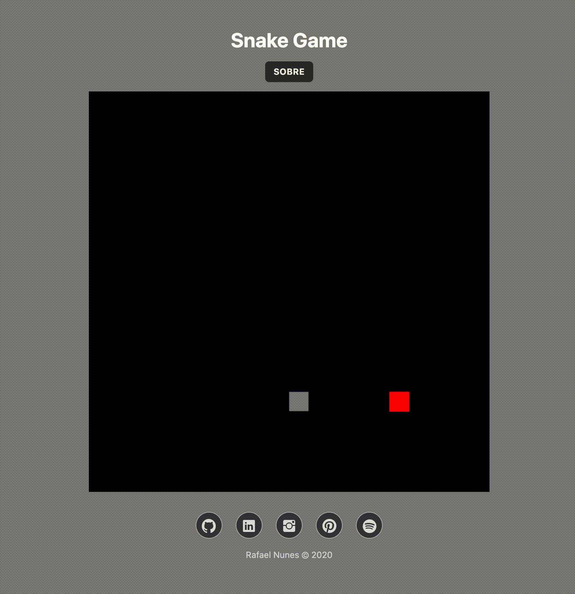

    

 

## 💻 Projeto

Se existe uma coisa que faz parte da vida de todo mundo são os games. Em vários formatos já apresentados, os clássicos nunca deixam de ser nossos preferidos. Tentando dar nova vida ao clássico jogo da cobrinha, apresento aqui o meu projeto. 
Como as versões mais antigas, o seu objetivo é pegar o quadradinho que estará em evidência pela cor (você saberá imediatamente). Agora é só usar as teclas cursores do seu teclado (as setinhas) e se desafiar tentando criar a maior cobrinha possível!

If there is one thing that is part of everyone's life it is games. In several formats already presented, the classics never cease to be our favorites. Trying to give new life to the classic snake game, I present here my project.
Like the older versions, your goal is to get the square that will be highlighted by the color (you will know it immediately). Now just use the arrow keys on your keyboard (the little arrows) and challenge yourself trying to create the largest snake possible!

  

 

## 🚀 Tecnologias

Esse projeto foi desenvolvido com as seguintes tecnologias:

- [HTML5](https://html5.org/)
- [CSS](http://www.css3.info/)
- [JavaScript](https://www.javascript.com/)
- [Bootstrap](https://getbootstrap.com/)

## 📝 Licença 

Esse projeto está sob a licença MIT. Veja o arquivo [LICENSE](https://github.com/rafaelnpf/Snake-Game/blob/master/LICENSE) para mais detalhes.

---
Feito por [Rafael Nunes.](https://github.com/rafaelnpf)
